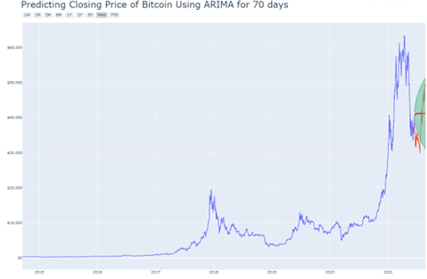
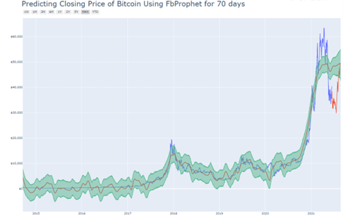

# Forecasting Cryptocurrency using ARIMA and Prophet

### The Goal:
The primary goal of the project was to create a web application using Django and Python that enables users to view cryptocurrency tickers, time spans, and other relevant parameters. Additionally, the project aimed to develop detailed analytical and statistical machine learning models to predict the prices of selected cryptocurrencies.

### Solution:
The solution involved designing and building a Django-based web application that allows users to interact with various cryptocurrency data. The application presents the top 10 cryptocurrencies, scrapes data from Yahoo Finance using BeautifulSoup, and performs time series analysis with ARIMA and Prophet models. The project included creating interactive visualizations, handling missing values, and applying different methods for detrending and stationarity testing.

### Outcomes:
- Successfully developed a Django web application to display cryptocurrency data.
- Implemented data scraping using BeautifulSoup and yfinance packages.
- Built and compared time series models (ARIMA and Prophet) for price prediction.
- Created interactive visualizations using Plotly to enhance user experience.
- Managed effective project delivery from scope definition to final deployment.

## Django Web-Development

</a>

### Challenges Faced:
- Handling the high volatility and unregulated nature of cryptocurrencies.
- Managing the large variation in the number of observations across different cryptocurrencies.
- Addressing missing values in the data collected from Yahoo Finance.
- Ensuring accurate prediction models by considering unique cryptocurrency events like Bitcoin halving and Ethereum coin burning.
- Implementing effective detrending methods to achieve stationarity in time series data.

### Skills Gained:
- Proficiency in Python, including web development with Django.
- Expertise in data scraping using BeautifulSoup and yfinance packages.
- Ability to create interactive data visualizations with Plotly.
- Knowledge of building and evaluating time series models (ARIMA and Prophet).
- Experience in handling missing data and applying various detrending techniques.
- Practical skills in project management, from initial scope to deployment.

### Forecasting Figures

##### Prophet prediction for test set for 70 days
</a>

##### ARIMA prediction for test set for 70 days
</a>

##### The PACF and ACF plots show no autocorrelation for Logged Close Difference
</a>
